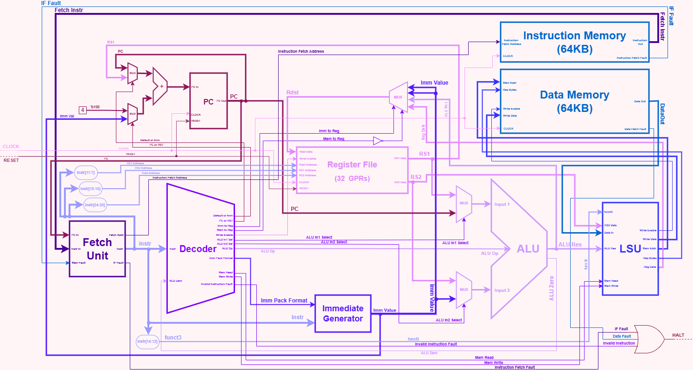

# riscVia

5-stage pipelined RV32I CPU with Harvard Memory Architecture and Forwarding implemented on an FPGA

## Specifications

The CPU is based on the RV32I architecture. It contains implementation the base 40 instructions (minus `FENCE`, which is a NOP). Specifications include 32 General Purpose Registers (x0 hardwired to 0), 32-bit word size, 32-bit instruction size, and a 32-bit program counter (PC). The CPU is pipelined with 5 stages (IF -> ID -> EX -> MEM -> WB), and deals with hazards using stalling. For more information related to the RV32I architecture, please check the [official RISC-V specification.](https://docs.riscv.org/reference/isa/v20260120/unpriv/rv32.html)

## Diagram

(**NOTE: The diagram is still to be updated for pipelining. The image below is that of the existing single cycle version.**)  



## Modules and Working

The CPU uses the IF -> ID -> EX -> MEM -> WB cycle. The main parts and modules of the CPU are categorized in the following manner, with each category having different components that serve different purposes in the CPU. -  

### Core Components

These components are an integral part of the CPU, being responsible for storing data, directing control flow, and complmenting the main units.

- [**Register File**](src/design/core/components/reg_file.sv) - Register File containing the 32 general purpose registers. Outputs of the module are `r_data1` and `r_data2`, used by the execution units as operands, and which can be selected via their respective address inputed. Includes a provision for writing to a register, via selcting `w_enable`, the `w_addr`, and `w_data` to be written. `x0` is permanently hardwired to zero. Updated on positive clock edge, and allows asynchronous reset on negative edge on active low input.
- [**Program Counter**](src/design/core/components/pc.sv) - Program counter of the CPU, which points to the byte of the currently executing instruction in the instruction memory. Always initialized at byte 0. Increments by 4 by default on every positive clock edge. However, depending on the instruction, the PC can either be incremented by `IMM`, or be set to `rs1 + IMM`, based on the `pcinc_in1_pcor` and `pcinc_in2_doi` inputs respectively. Allows asynchronous reset on negative edge on active low input.

### Unit Stages

These components form the backbome of the Fetch-Decode-Execute-Memory Access-Writeback cycle. Each stage interconnects with each other via pipeline registers (as described later on), which are updated on clock edge.

- [**Fetch Unit**](src/design/core/units/fetch.sv) - Fetch unit of the CPU, responsible for fetching the instructions from the instructions memory with the help of the program counter, and feeding it to the decoder. Currently functions largely as a wrapper around the `pc`, `instr`, and `mem_fault` lines. Purely combinational, and feeds `mem_fault` signals to the `HALT` unit.
- [**Decoder**](src/design/core/units/decoder.sv) - Decoder of the CPU, part of the controller responsible for decoding instructions for the rest of the CPU to execute. Purely combinational, and primarily decodes instructions based on the 7 `opcode` bits of the CPU. In addition, for arithmetic and logic instructions, the ALU looks at the `funct3` and `funct7` bits of the instruction to generate an equivalent signal for the ALU operation, given by the `alu_op` output. In addition, the decoder signals the Immediate Generator the respective format required to unpack immediate values for the instruction. Also gives signals to the PC, Reg File, and LSU to perform an operation based on the instruction.
- [**Immediate Generator**](src/design/core/units/imm_gen.sv) - Part of the decoder which generates immediate values from the instructions, and unpacks them based on signals given by the decoder, based on I, S, B, U, and J instructions. After unpacking, the module sends the value as a Word with respective sign-extended or zero-padded bits to either the ALU's `input_2` or the Reg File directly, if the instruction can bypass the ALU (eg. `LUI`).
- [**ALU**](src/design/core/units/alu.sv) - Arithmetic and Logic Unit, responsible for performing calculations for the CPU, and giving the result as an output. Supports 10 basic operations - `ADD`, `SUB`, `XOR`, `OR`, `AND`, `SLL`, `SRL`, `SRA`, `SLT`, and `SLTU`. In addition, both ALU inputs can support either Reg + Reg, Reg + IMM, or even PC + IMM operations (from the AUIPC instruction), controlled by the input signals `alu_in1_ropc` and `alu_in2_roi` from the decoder.
- [**Branch Unit**](src/design/core/units/branch_unit.sv) - Part of the execution phase which evaluates a branch condition based on the opcode and the ALU result, and accordingly emits a signal `branch_taken` which determines whether the CPU should successfully branch or not. A successful branch directly updates the PC, but also signals the hazard unit the flush the registers (convert to NOPs) to prevent the CPU from executing the now incorrect unbranched instructions.
- [**LSU**](src/design/core/units/lsu.sv) - Load store unit of the CPU, responsible for communicating with the Reg File and Data Memory Unit, requesting and writing data, and initiating `LOAD` and `STORE` instructions. Uses signals from the decoder to determine if the instruction is a LOAD or a STORE, utilizes the `funct3` field to check the number of bytes to be requested, and uses the `alu_res` input from the ALU to forward the address to the memory unit. Uses the `is_mem_read` and `is_mem_write` fields to determine if the instruction is a `LOAD` or a `STORE`, and prevent the CPU from accidentally faulting if there is no mem access instruction. In addition, uses a `req_bytes` signal to request a certain number of bytes from the data memory (1, 2, or 4 bytes), depending on the instruction.

### Pipeline Registers

Piepline Registers are registers that store data about the CPU and it's particular stage of execution pertaining to that instruction. There is one pipeline register between any two successive stages, totalling up to 4 pipeline registers for the 5 stage processor. Pipeline registers only update on clock edge, and can be cleared via a clear signal on said clock edge, unless they are asynchronously reset via a reset signal.

- [**IF/EX Register**](src/design/core/pipeline/if_id.sv) - The first pipeline register between the IF and ID stages. Contains 64 bits, specifically the current fetched instruction and the PC value corresponding to that instruction fetch.
- [**ID/EX Register**](src/design/core/pipeline/id_ex.sv) - The second pipeline register between the ID and EX stages. It is the largest register by far, containing a total of 164 bits, which includes the PC value from the previous register, register file addresses and values, alu specific operation values, and a large number of metadata gathered from the decoder.
- [**EX/MEM Register**](src/design/core/pipeline/ex_mem.sv) - The third pipeline register between the EX and MEM stages. Contains a total of 78 bits, including the ALU result, destination register data, RS2 data, and other data from the ID/EX register relating to the MEM and WB stages.
- [**MEM/WB Register**](src/design/core/pipeline/mem_wb.sv) - The fourth pipeline register between the MEM and WB stages. Contains 40 bits, the smallest pipeline register, containing information related to WB and data that aids with data dependency analysis by the hazard unit.

### Hazard Handling

The following components are used to handle hazards caused by pipeline faults during CPU execution.

- [**Hazard Unit**](src/design/core/hazard_unit/hazard_unit.sv) - Hazard detection unit of the CPU, which handles all data and control hazards by emitting signals. This includes flushing the IF/ID and ID/EX registers (to resolve control hazards via the `if_id_clear` and `id_ex_clear` signals), detecting data dependencies and stalling the CPU accordingly by freezeing the PC to create bubbles and eliminate said dependencies (to resolve data hazards via the `pc_enable` and `if_id_enable` registers), or forwarding values directly from downstream pipeline registers to the ALU inputs to eliminate many data hazards. It is a parent module which integrates the dependency analyzer, forwarding unit, and stall unit together. In addition, the unit generates metadata whenever a stall or flush occurs, which is used for advanced telemetry tracking.
- [**Dependency Analyzer**](src/design/core/hazard_unit/dep_analyzer.sv) - Dependency analyzer of the hazard unit checks for dependencies between registers of different CPU stages via the corresponding pipeline registers' metadata (i.e. if two register addresses match). Generates a high signal depending on the dependency, and also a signal indicating if the specific register field's dependency (`rs1` or `rs2`) is valid based on the instruction's opcode.
- [**Forwarding Unit**](src/design/core/hazard_unit/fwd_unit.sv) - CPU's forwarding unit which uses signals from the dependency analyzer to generate a respective signal to forward data from a downstream pipeline register up to the ALU's input. The output ports from this unit are connected directly to the ALU, in which they are multiplexed with the downstream `rdst` write back data. This helps eliminate many data hazards without unnecessary stalling.
- [**Stall Unit**](src/design/core/hazard_unit/stall_unit.sv) - CPU's global stall unit which helps deal with hazards which cannot be resolved using forwarding. This includes control hazards, by taking in a signal from the branch unit to flush the CPU, and helps catching load-use data hazards early by creating bubbles which can be converted into forwardable hazards.

### General Core Components

These are higher level components in the CPU core, pertaining to integrating all CPU submodules together and telemetry tracking.

- [**CPU Core and Buses**](src/design/core/rv32i_core.sv) - Responsible for connecting all the aforementioned modules together, and maintaining functioning of the CPU. The core itself has multiple ports, including two for `CLOCK` and `RESET` (`clk` and `rst_n`), multiple signals from the FU/LSU to connect to the memory units, and a port connecting to the `HALT` unit of the CPU, which is raised during a fault that causes the CPU to panic.
- [**Telemetry Tracker**](src/design/core/meta.sv) - Telemetry tracker and metadata unit which keeps track of multiple values recorded during the CPU's execution time such as CPU STOP (from a STOP instruction `0xFFFFFFFF`), instruction count (`instr_count`), number of stalls (`stall_count`), number of Load-Use stalls (`l_use_count`), and branch flush count (`br_flush_count`). The simulation directly tracks these values and displays them at the end of the program to measure CPU performance (such as CPI). A CPU's reset signal will reset these values to 0.

### CPU Memory

While not a part of the core, the instruction and data memory are vital parts of the system which the CPU requires to execute instructions and store data.

- [**Instruction Memory**](src/design/mem/instr_mem.sv) - The instruction memory's main role is to store the instructions that are to be used and executed by the CPU. It is currently a read-only memory (ROM), meaning that the instructions can only be fetched from it, not loading into it proactively. The instruction can be fetched by providing its address through the `instr_addr` port (provided by the program counter) and outputs the respective instruction (or word) present at the memory address (upto 3 additional succeeding bytes) via the `instr_out` port, and is only updated on `clk` edge. In addition, it includes a provision for raising a fault (`IF Fault`) if an instruction address is not found or a fetch fails.  
- [**Data Memory**](src/design/mem/data_mem.sv) - The data memory plays an integral role by loading and storing the data required by the CPU during memory accesses. Upon requesting data from the CPU, depending on the number of bytes modeled by `req_bytes`, it will either read the memory from the given address from said byte to the nth offset byte from that, or will write the memory at the given address until the nth offset byte if the `write_enable` signal is high. In addition, the memory unit includes a provision for raising a `Data Fault` (in case of Data Access Faults), if the requested access address or its following bytes go out of bounds.  
NOTE: By default, there is 64 KB of instruction memory and 64KB of data memory, although this may be changed via parameterization.  

The following mentioned modules are integrated and connected together in the `top.sv` module ([accessible through here](src/design/top.sv)), and are tested via the C++ Verilator testbench in the `sim_main.cpp` module ([accessible through here](src/sim_main.cpp)).

## Installation and Testing

The CPU above was tested using Verilator v5.048. The testbench for the CPU is accessible via `sim_main.cpp`.  

To test the processor, the following toolchain(s) were used -

- `Verilator v5.048`: Built using the `GCC` compiler in `C++23`
- `MSYS UCRT64 shell`: Shell used for compilation and running the simulation
- `RISC-V Toolchain`: `riscv64-unknown-elf-as` assembler, `riscv64-unknown-elf-ld` linker, and `riscv64-unknown-elf-objcopy` object copy
- `GTKWave`: (optional, accessible via `waveform.vcd`)
- `Python 3.11.0`: To build the RISC-V hex dump generator

The CPU simulation can be done in two different ways -

### By compiling an existing assembly program

1. Install the aforementioned tools from their respective websites online.

2. Go to your directory and clone the repository -
  
    ```bash
    git clone https://github.com/semismash/riscVia
    ```

3. Name your assembly file to `program.s` and place it in the root folder. The assembly must contain only base RV32I instructions for the CPU to execute properly.
**NOTE: Sample assembly programs are present in the [progs](progs/) directly, which can be used for testing the CPU.**

4. Open the `MSYS UCRT64` shell, and run the program using -

   ```bash
   make clean && make run
   ```

   Alternatively, `make run` can be directly used if all the program binaries have been cleared.
   **NOTE: The `tmp/` folder in the root directory is used by the compilation process to generate the binary and associated object files.**

5. After this, the testbench can be monitored as normal. By default, the testbench shows 31 general purpose registers (from `x1` - `x31`) and their respective values every cycle, although this may be changed to a custom rain within [`sim_main.cpp`](src/sim_main.cpp). After the simulation ends, the program will display whether the simulation stopped safely, crashed due to reaching the max cycle count, or unexpectedly crashed after the CPU generated a halt signal. In addition, it will display telemetry regarding the CPU's final CPI, stalls and flushes.

### If program.bin already exists

1. Install the aforementioned tools from their respective websites online.

2. Go to your directory and clone the repository -
  
    ```bash
    git clone https://github.com/semismash/riscVia
    ```

3. If you already have a RISC-V binary file, rename it to `program.bin`, place it in the root directory, and proceed directly to step 6. Otherwise, you may follow the next few steps.

4. Using a basic program in RV32I, use an [online visualizer](https://risc-v-cpu-visualizer.vercel.app/) to convert the program into raw binary.

5. Launch bingen.py via -

    ```bash
    py bingen.py
    ```

    Copy the binary into the terminal and press enter twice to get the `printf` hex-dump statement. This may be done multiple times, and can be exited by typing `exit` or `quit`.

    (NOTE: Alternatives, if you already have an RV32I binary, you can just name it `program.bin` and place it in the project's root directory.)

6. Open the `MSYS UCRT64` shell, and execute the following commands to clean the directory, place the hex-dump into the folder, and run the testbench.

    ```bash
    cd path/to/your/repo
    make clean
    printf "<your hex dump>" > program.bin
    make sim
    ```

    If you already have a binary file, name it `program.bin`, place it in the root directory, and run `make sim` directly.

7. After this, the testbench can be monitored as normal. By default, the testbench shows 31 general purpose registers (from `x1` - `x31`) and their respective values every cycle, although this may be changed to a custom rain within [`sim_main.cpp`](src/sim_main.cpp). After the simulation ends, the program will display whether the simulation stopped safely, crashed due to reaching the max cycle count, or unexpectedly crashed after the CPu generated a halt signal. In addition, it will display telemetry regarding the CPU's final CPI, stalls and flushes.

## Example program  

```bash
printf "\x17\x02\x00\x00\x13\x02\x02\x01\xe7\x00\x02\x00\x13\x01\x30\x06\x93\x01\xa0\x02\x00\x00\x00\x00" > program.bin
```

For reference, the given program does the following -

```riscv
auipc x4, 0             # x4 = current PC
addi  x4, x4, 16        # x4 = label
jalr  x1, 0(x4)         # jump, x1 = return address
addi  x2, x0, 99        # skipped
addi  x3, x0, 42        # x3 = 42
```

### Message from the Developer

Thanks for checking out my project! Stay tuned for more updates :D